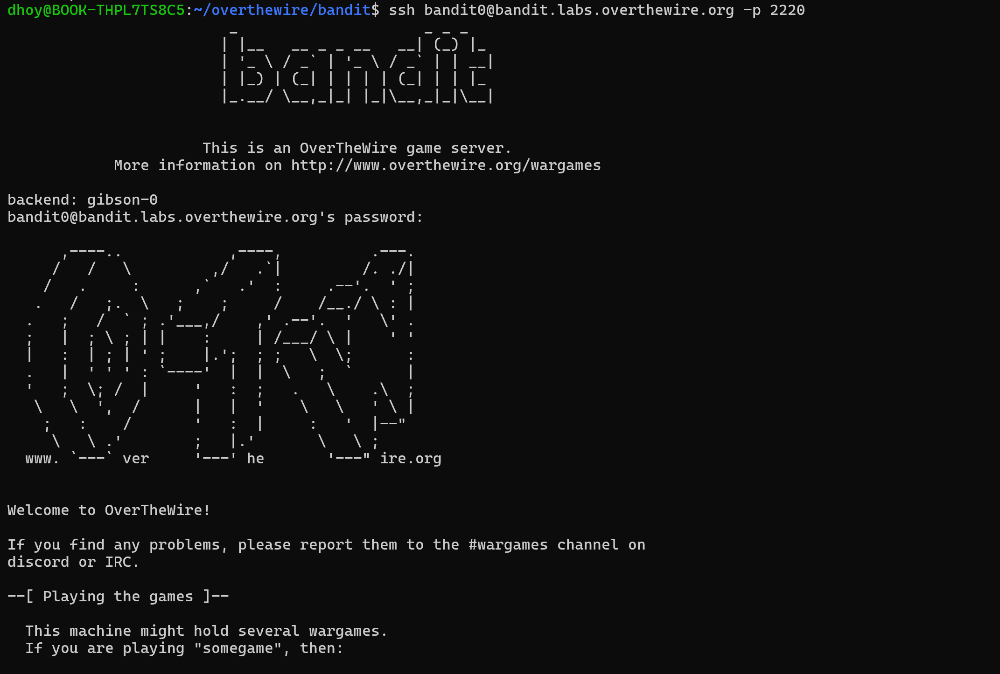

# bandit level 0~10

## bandit0

> **SSH 접속이란?? →** 공부하기
> 



```bash
                         _                     _ _ _
                        | |__   __ _ _ __   __| (_) |_
                        | '_ \ / _` | '_ \ / _` | | __|
                        | |_) | (_| | | | | (_| | | |_
                        |_.__/ \__,_|_| |_|\__,_|_|\__|

                      This is an OverTheWire game server.
            More information on http://www.overthewire.org/wargames

backend: gibson-0
bandit0@bandit.labs.overthewire.org's password:

      ,----..            ,----,          .---.
     /   /   \         ,/   .`|         /. ./|
    /   .     :      ,`   .'  :     .--'.  ' ;
   .   /   ;.  \   ;    ;     /    /__./ \ : |
  .   ;   /  ` ; .'___,/    ,' .--'.  '   \' .
  ;   |  ; \ ; | |    :     | /___/ \ |    ' '
  |   :  | ; | ' ;    |.';  ; ;   \  \;      :
  .   |  ' ' ' : `----'  |  |  \   ;  `      |
  '   ;  \; /  |     '   :  ;   .   \    .\  ;
   \   \  ',  /      |   |  '    \   \   ' \ |
    ;   :    /       '   :  |     :   '  |--"
     \   \ .'        ;   |.'       \   \ ;
  www. `---` ver     '---' he       '---" ire.org

Welcome to OverTheWire!

If you find any problems, please report them to the #wargames channel on
discord or IRC.

--[ Playing the games ]--

  This machine might hold several wargames.
  If you are playing "somegame", then:

    * USERNAMES are somegame0, somegame1, ...
    * Most LEVELS are stored in /somegame/.
    * PASSWORDS for each level are stored in /etc/somegame_pass/.

  Write-access to homedirectories is disabled. It is advised to create a
  working directory with a hard-to-guess name in /tmp/.  You can use the
  command "mktemp -d" in order to generate a random and hard to guess
  directory in /tmp/.  Read-access to both /tmp/ is disabled and to /proc
  restricted so that users cannot snoop on eachother. Files and directories
  with easily guessable or short names will be periodically deleted! The /tmp
  directory is regularly wiped.
  Please play nice:

    * don't leave orphan processes running
    * don't leave exploit-files laying around
    * don't annoy other players
    * don't post passwords or spoilers
    * again, DONT POST SPOILERS!
      This includes writeups of your solution on your blog or website!

--[ Tips ]--

  This machine has a 64bit processor and many security-features enabled
  by default, although ASLR has been switched off.  The following
  compiler flags might be interesting:

    -m32                    compile for 32bit
    -fno-stack-protector    disable ProPolice
    -Wl,-z,norelro          disable relro

  In addition, the execstack tool can be used to flag the stack as
  executable on ELF binaries.

  Finally, network-access is limited for most levels by a local
  firewall.

--[ Tools ]--

 For your convenience we have installed a few useful tools which you can find
 in the following locations:

    * gef (https://github.com/hugsy/gef) in /opt/gef/
    * pwndbg (https://github.com/pwndbg/pwndbg) in /opt/pwndbg/
    * gdbinit (https://github.com/gdbinit/Gdbinit) in /opt/gdbinit/
    * pwntools (https://github.com/Gallopsled/pwntools)
    * radare2 (http://www.radare.org/)

--[ More information ]--

  For more information regarding individual wargames, visit
  http://www.overthewire.org/wargames/

  For support, questions or comments, contact us on discord or IRC.

  Enjoy your stay!
```


`bandit0: ZjLjTmM6FvvyRnrb2rfNWOZOTa6ip5If`


## bandit1


`bandit1: 263JGJPfgU6LtdEvgfWU1XP5yac29mFx`

## bandit2


한 반년 전만 해도 -가 없었어서 그냥 sp까지만 치고 tab 치면 됐었는데, 바뀐 것 같음


와일드카드로도 열 수 있긴 함

`bandit2: MNk8KNH3Usiio41PRUEoDFPqfxLPlSmx`

## bandit3


`bandit3: 2WmrDFRmJIq3IPxneAaMGhap0pFhF3NJ`

## bandit4


human-readable file 이라네요


`bandit4: 4oQYVPkxZOOEOO5pTW81FB8j8lxXGUQw`

## bandit5


`bandit5: HWasnPhtq9AVKe0dmk45nxy20cvUa6EG`

## bandit6


루트 디렉토리로 가서 find . 을 해도 되고 아니면 애초에 검색할 때 find / 해도 되고..


조건에 부합하는 파일들이 굉장히 많은데 눈으로 찾아도 되고 아님 에러 메시지 처리를 해도 되고..


이걸 검색 안하고 해버리네 ㅋㅋㅋ

이거 근데 find 결과값을 인자로 받아서 cat 하는 방법이.. 있을듯


`bandit6: morbNTDkSW6jIlUc0ymOdMaLnOlFVAaj`

## bandit7


`bandit7: dfwvzFQi4mU0wfNbFOe9RoWskMLg7eEc`

## bandit8


`bandit8: 4CKMh1JI91bUIZZPXDqGanal4xvAg0JM`

## bandit9


이건 grep에 -a 옵션으로 하니까 답이 나오긴 하는데 이게 왜 되는지는 모르겠네.. `grep -a “=” data.txt`


`bandit9: FGUW5ilLVJrxX9kMYMmlN4MgbpfMiqey`

얜 나중에 복습 ㄱㄱ

## bandit10


대충 감으로 명령어 찍어버림 ㅋㅋㅋ

`bandit10: dtR173fZKb0RRsDFSGsg2RWnpNVj3qRr`
